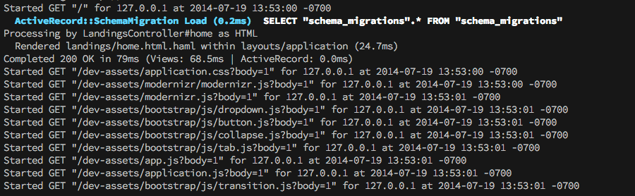
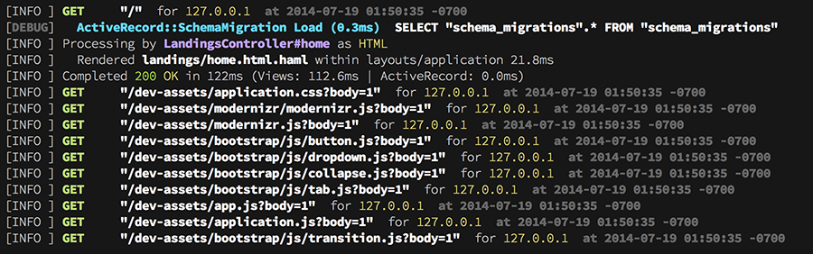

# Shog

[](http://badge.fury.io/rb/shog)
[](https://codeclimate.com/github/phallguy/shog)
[](https://circleci.com/gh/phallguy/shog)

(Also check [scorpion](http://github.com/phallguy/scorpion) for a light-weight IoC container)

Simple colored logging for rails 4 and 5 apps.

There are plenty of logging frameworks for making tags (like timestamp, log
level, etc.) more colorful - but what about the details in the line of text?
What about the HTTP method used to make the request? What about the render
times?

Shog adds colors to highlight context and make it easier to pick out the
important parts of the message. Unformatted logs like this



become easy to ready and process logs like this



## Using Shog

Just add the following to your Gemfile to enable shiny output logs.

```
gem 'shog'
```

Shog comes built in with some sane defaults for rails apps. But you can
customize the output  to match additional log message by your app, or to use
different options in production.

To change the defaults, add `shog.rb` to your `config/initializers` folder

```ruby
Shog.configure do
  if ::Rails.env.production?
    reset_config!
    timestamp
  end

  match /execution expired/ do |msg,matches|
    # Highlight timeout errors
    msg.red
  end
end
```

See [Shog::Formatter#configure](lib/shog/formatter.rb) for more configuration options.

## Contributing

1. Fork it ( https://github.com/phallguy/shog/fork )
2. Create your feature branch (`git checkout -b my-new-feature`)
3. Commit your changes (`git commit -am 'Add some feature'`)
4. Push to the branch (`git push origin my-new-feature`)
5. Create a new Pull Request


# License

[The MIT License (MIT)](http://opensource.org/licenses/MIT)

Copyright (c) 2014 Paul Alexander
